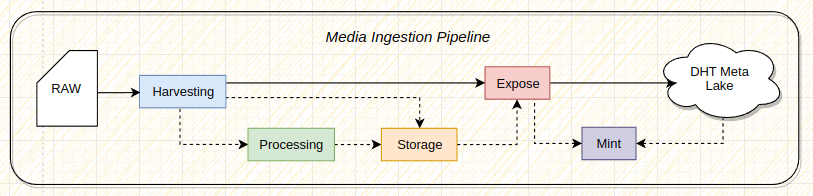

# Nucleus

  
  

***NOTE!*** Nucleus is **alpha-stage** software. It means nucleus hasn't been security audited and programming APIs and data formats can still change.

Nucleus is a collection of low-level tools for media decentralization. It offers functionalities to make it easier to process, store, and distribute multimedia in a decentralized way.

The key features of Nucleus include:

- Metadata harvesting
- Multimedia processing
- Multimedia storage
- Metadata distribution
- Web3 instruments

Nucleus follows a modular and layered design approach, consisting of the following layers:

1. **The Core**: This layer contains the building block packages that have minimal or no external dependencies. Any dependencies within the core layer will be limited to other internal packages.

2. **The SDK**: The SDK exposes the programming-level API to interact with the core functions in a safe and conformant way.

3. **The CLI and HTTP API**: These components utilize the SDK to provide services through command-line interfaces (CLI) and HTTP API endpoints.

## Summary

Nucleus proposes a sequence of steps (pipeline) for the processing and decentralization of multimedia:

1. **Harvesting**: Collect metadata associated with the multimedia content.
2. **Processing**: Performing media processing tasks.
3. **Storage**:  Store the processed content in the IPFS network.
4. **Expose**: Distribute metadata through the IPFS ecosystem.
5. **Mint**: Create metadata as NFTs (Non-Fungible Tokens).
6. **Retrieval**: Retrieve and unmarshal metadata for further distribution.

The pipeline design follows the decoupling principle, allowing for flexible use cases. For example, the **storage** component can be optional if data is already stored on the IPFS network. Similarly, the **mint** component can be skipped if there is no need to create NFTs for the metadata. The **processing** component may also be unnecessary if the media is already prepared for storage.

The **Retrieval** component facilitates the retrieval and unmarshalling of metadata from IPFS ecosystem, which can then be distributed through various means. eg.OrbitDB, Gun, etc..

## Installing

Before using `nucleus`, FFmpeg and IPFS must be installed.

1) Check the official docs to [install IPFS](https://docs.ipfs.tech/install/command-line/#system-requirements).
2) There are a variety of ways to install FFmpeg, such as the [official download links](https://ffmpeg.org/download.html), or using your package manager of choice (e.g. `sudo apt install ffmpeg` on Debian/Ubuntu, `brew install ffmpeg` on OS X, etc.).

## Examples

- [Full Pipeline](./examples/full.py)

## Development

Some available capabilities for dev support:

- **Install**: `make bootstrap`
- **Tests**: `make test`
- **Debug**: `make test-debug`
- **Lint**: `make code-check`
- **Lint Fix**: `make code-fix`

Note: Please check [Makefile](https://github.com/SynapseMedia/nucleus/blob/main/Makefile) for more capabilities.  

<!-- ## More info

- Visit our site [watchit.movie](http://watchit.movie).
- Read our post in [dev.to](https://dev.to/geolffreym/watchit-2b88).
- Get in touch with us in [gitter](https://gitter.im/watchit-app/community).
- For help or bugs please [create an issue](https://github.com/ZorrillosDev/watchit-toolkit/issues). -->

## Contributors ✨

Thanks goes to these wonderful people ([emoji key](https://allcontributors.org/docs/en/emoji-key)):

<!-- ALL-CONTRIBUTORS-LIST:START - Do not remove or modify this section -->
<!-- prettier-ignore-start -->
<!-- markdownlint-disable -->
<table>
  <tr>
    <td align="center"><a href="https://github.com/phillmac"> <b>phillmac</b></a> <a href="https://github.com/ZorrillosDev/watchit-gateway/commits?author=phillmac" title="Code">💻</a> <a href="#userTesting-phillmac" title="User Testing">📓</a> <a href="#ideas-phillmac" title="Ideas, Planning, & Feedback">🤔</a> <a href="#infra-phillmac" title="Infrastructure (Hosting, Build-Tools, etc)">🚇</a></td>
    <td align="center"><a href="http://mrh.io"> <b>Mark Robert Henderson</b></a> <a href="https://github.com/ZorrillosDev/watchit-gateway/commits?author=aphelionz" title="Code">💻</a> <a href="#ideas-aphelionz" title="Ideas, Planning, & Feedback">🤔</a></td>
    <td align="center"><a href="https://github.com/EchedeyLR"> <b>Echedenyan</b></a> <a href="#infra-EchedeyLR" title="Infrastructure (Hosting, Build-Tools, etc)">🚇</a></td>
  </tr>
</table>

<!-- markdownlint-restore -->
<!-- prettier-ignore-end -->

<!-- ALL-CONTRIBUTORS-LIST:END -->

This project follows the [all-contributors](https://github.com/all-contributors/all-contributors) specification. Contributions of any kind welcome!
